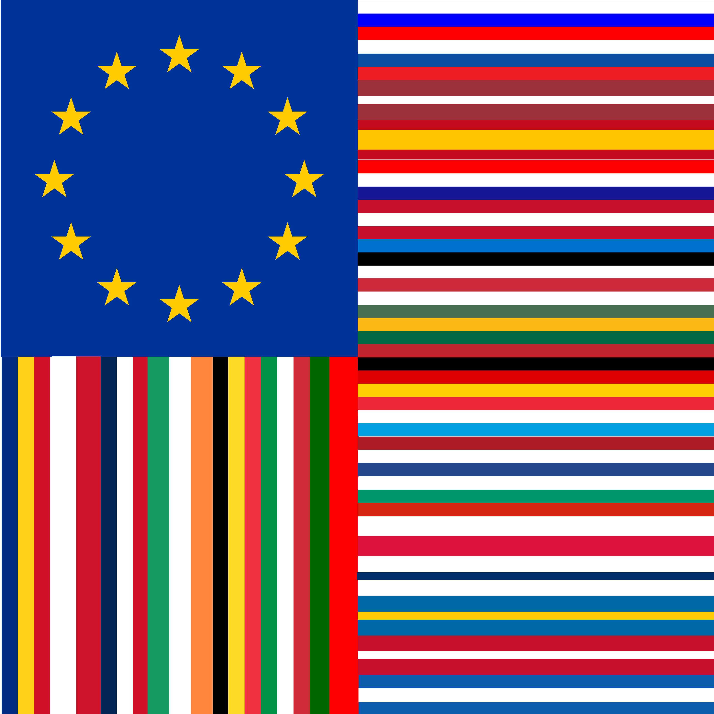

# The New Europe Flag

## Principles

- the flag has to be extensible with new stripes
- retain the circle of 12 stars
- the first country's flag (left) of the vertical stripes has to begin with a blue as close to the EU flag as possible (Romania's flag meets the criteria)
- the first contry's flag (top) of the horizontal stripes has to begin with a blue as close to the EU flag as possible. Maybe also the last stripe should meet this criteria

## Variations

- are possible and will happen each time a new country becomes member or breaks away
